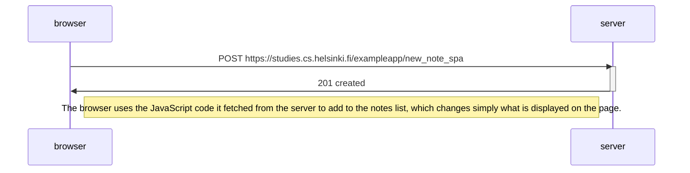

```mermaid
sequenceDiagram
    participant browser
    participant server

    browser->>server: POST https://studies.cs.helsinki.fi/exampleapp/new_note_spa
    %% Server adds contents of the body of the post request to the notes array in the server %%
    activate server
    server->>browser: 201 created
    deactivate server

    Note right of browser: The browser uses the JavaScript code it fetched from the server to add to the notes list, which changes simply what is displayed on the page.
```